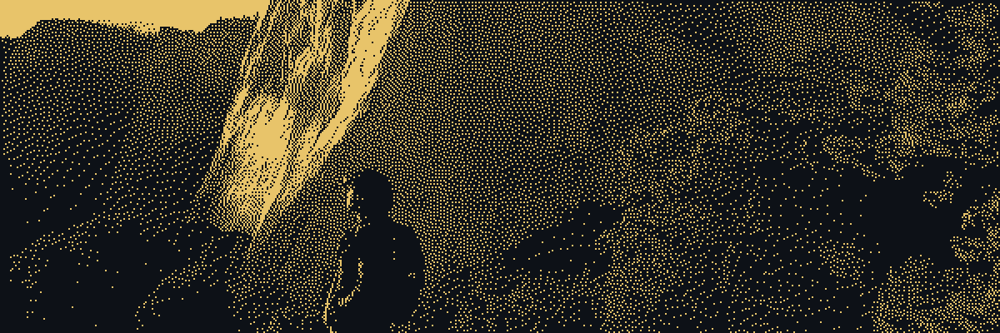

<picture>
  <source media="(prefers-color-scheme: dark)" srcset="assets/header-dark.png" />
  <source media="(prefers-color-scheme: light)" srcset="assets/header-light.png" />
  
</picture>

  

  
CS + Math at UChicago. Building Gemini Enterprise Agents at Google.

  

    <a href="https://darylecheazu.me">Website</a> ·
    <a href="https://www.linkedin.com/in/daryl-echeazu/">LinkedIn</a> ·
    <a href="mailto:darecheazu@uchicago.edu">Email</a>
  

 

<picture>
  <source media="(prefers-color-scheme: dark)" srcset="https://raw.githubusercontent.com/Daryl-Echeazu/Daryl-Echeazu/output/snake-dark.svg" />
  <source media="(prefers-color-scheme: light)" srcset="https://raw.githubusercontent.com/Daryl-Echeazu/Daryl-Echeazu/output/snake-light.svg" />
  
</picture>
